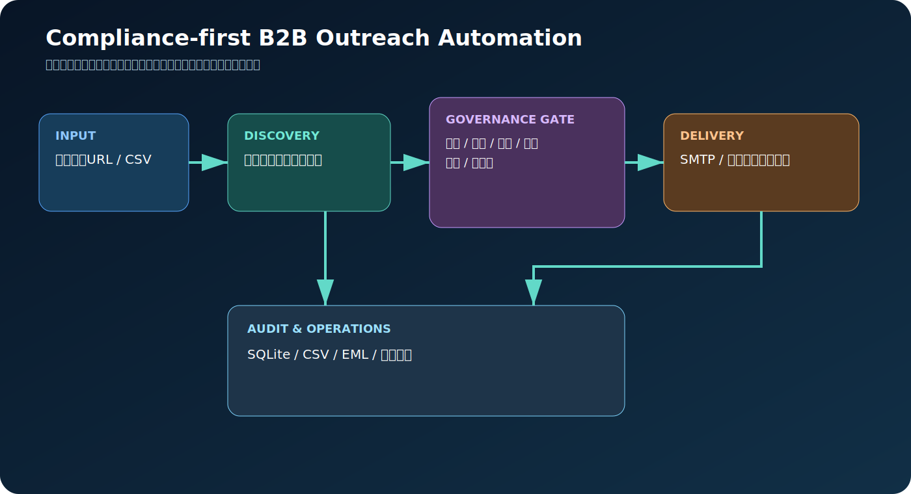
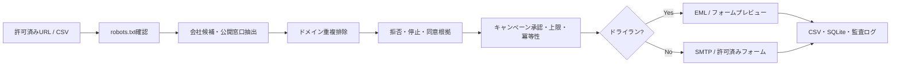

# Compliant B2B Outreach Automation



公開された法人窓口を対象に、会社候補の収集、連絡先抽出、ドメイン単位の重複排除、営業拒否表示の検出、メール／問い合わせフォームのドライラン、承認済みキャンペーンの実行、停止リスト、日次上限、監査ログを一体化したPython基盤です。

> **重要**: 無差別な大量送信、CAPTCHA回避、ログイン領域の収集、個人メールアドレスの推測、サイト規約を無視したクローリングを目的としません。既定値は常にドライランです。実送信にはキャンペーン承認、環境変数、フォーム送信先ドメインの明示許可が必要です。

## できること

- 業界団体・公開事業者一覧・自社保有URLを起点に会社候補を発見
- `robots.txt`を確認し、会社概要・問い合わせページを巡回
- 法人名、公開メール、電話、問い合わせフォームを抽出
- 正規化ドメインで重複排除し、毎日差分更新
- 営業拒否文言、停止リスト、同意根拠、承認状態を配送前に判定
- 日次上限、同一ドメイン上限、1社1キャンペーン1チャネルの冪等性を強制
- SMTPメールとPlaywrightフォーム入力をドライラン／実行
- CAPTCHA、許可リスト外ドメイン、未承認キャンペーンを自動スキップ
- FastAPI、Typer CLI、Docker、Codespaces、GitHub Actionsを提供
- CSV、SQLite、EML、フォームプレビューをActions artifactとして保存

## 採用OSS

| 用途 | 採用 | 理由 |
|---|---|---|
| HTML解析 | Beautiful Soup | 抽出ルールを監査しやすい |
| HTTP巡回 | HTTPX | async、タイムアウト、リダイレクト制御が明確 |
| フォーム操作 | Microsoft Playwright | 決定論的なセレクタと主要ブラウザ対応 |
| API | FastAPI | 型付きAPIとOpenAPI UI |
| DB | SQLModel + SQLite | 小規模開始と移行が容易 |
| スケジュール | GitHub Actions | サーバなしの日次更新とartifact保存 |

Scrapy、scrapy-playwright、Crawl4AI、n8n、Mautic、listmonk、browser-use、Playwright MCPも比較しました。詳細は [`docs/oss-evaluation.md`](docs/oss-evaluation.md) を参照してください。大規模クロールではScrapy、許諾済みニュースレターではMautic/listmonk、業務連携ではn8nを追加する構成が有効です。任意フォームへのAIエージェント送信は誤操作リスクが高いため、標準実装はPlaywrightの決定論的処理に限定しています。

## 処理フロー



## 最短セットアップ

### Codespaces

リポジトリの **Code → Codespaces → Create codespace** を開き、次を実行します。

```bash
cp .env.example .env
outreach-bot init-db
outreach-bot serve
```

`http://localhost:8000/docs` に管理APIが表示されます。

### Docker

```bash
cp .env.example .env
docker compose up --build
```

### ローカルPython

```bash
python -m venv .venv
source .venv/bin/activate
python -m pip install -e '.[dev]'
cp .env.example .env
outreach-bot init-db
pytest
```

## 基本操作

`data/seeds.txt` に、利用規約とrobots.txtを確認済みの公開一覧URLを1行1件で記載します。

```bash
outreach-bot crawl --seed-file data/seeds.txt
outreach-bot export
```

既存リストはCSVから投入できます。

```bash
outreach-bot import-csv companies.csv
```

推奨列: `name,website_url,contact_email,contact_phone,contact_form_url,industry,prefecture`

キャンペーンを作成し、プレビュー後に承認します。

```bash
outreach-bot create-campaign \
  "不動産会社向け協業提案" \
  "{company_name}様への協業のご相談" \
  data/campaign-body.example.txt \
  --channels email,form \
  --daily-limit 20
outreach-bot approve-campaign 1
outreach-bot run-campaign 1
```

最後のコマンドはドライランです。`artifacts/` にメールの`.eml`とフォーム入力内容が生成されます。

実送信はSMTP、送信者、停止受付先、フォーム許可ドメインを設定し、明示的に有効化します。

```dotenv
OUTREACH_LIVE_EMAIL=true
OUTREACH_LIVE_FORMS=true
OUTREACH_ALLOWED_FORM_DOMAINS=example.jp,partner.example.com
```

```bash
outreach-bot run-campaign 1 --live
```

## 安全装置

- キャンペーンは作成直後 `approved=false`
- 実送信フラグがない場合は必ずプレビュー保存
- フォームは完全一致のドメイン許可リスト必須
- CAPTCHAを検出した場合は送信せず停止
- 営業拒否文言を検出した会社は送信対象外
- メール／ドメイン停止リストを全チャネルに適用
- 日次上限と同一ドメイン上限を適用
- 同一会社・キャンペーン・チャネルは再送しない
- robots.txtを確認し、非HTMLや取得失敗ページを除外
- メールに送信者表示と停止連絡先を付与

## GitHub Actions

- `CI`: push、pull request、手動実行でlint、test、CLI smoke test
- `Daily company refresh and outreach`: 毎日09:00 JSTにリスト更新とCSV出力
- 日次処理は既定でドライラン
- 実送信は手動実行とRepository Variable `OUTREACH_LIVE_APPROVED=true` の両方が必要
- SQLite、CSV、プレビューを `outreach-results-<run_id>` artifactとして30日保存

必要なVariables/Secretsは [`docs/setup.md`](docs/setup.md) に記載しています。

## 本番運用に必要なもの

1. 利用規約・robots.txt上で取得可能なシードURLまたは適法に取得したCSV
2. 送信者の会社名、氏名、返信可能なメールアドレス、停止受付先
3. SPF/DKIM/DMARCを設定した自社ドメインとSMTPサービス
4. フォーム送信を許可するドメイン一覧
5. キャンペーン内容と送信対象の社内承認
6. 永続化先。小規模はSQLite＋永続ボリューム、大規模はPostgreSQL
7. 苦情・停止依頼を即時反映する運用担当者

## 法務・プライバシー上の注意

日本の特定電子メール法では広告宣伝メールは原則オプトインです。公開された団体・営業者のメールアドレスは例外となる場合がありますが、受信拒否表示がある場合は例外になりません。送信者名称、受信拒否手段等の表示も必要です。また、氏名を含むメールアドレスは個人情報に該当し得ます。本リポジトリは法的判断を自動化するものではなく、対象・文面・取得元ごとの確認が必要です。

## 主要ファイル

```text
src/outreach_bot/     アプリ本体
  api.py              FastAPI
  cli.py              Typer CLI
  crawler.py          robots対応クロール・CSV取込
  extract.py          法人名・連絡先・拒否表示抽出
  policy.py           承認・停止・上限・冪等性判定
  mailer.py           SMTP／EMLプレビュー
  forms.py            Playwrightフォーム入力
  service.py          キャンペーン実行・CSV出力
tests/                ユニット／APIテスト
data/                 シードと文面サンプル
docs/                 構成・設定・OSS評価
.github/workflows/     CIと日次自動化
```

## ライセンス

MIT
