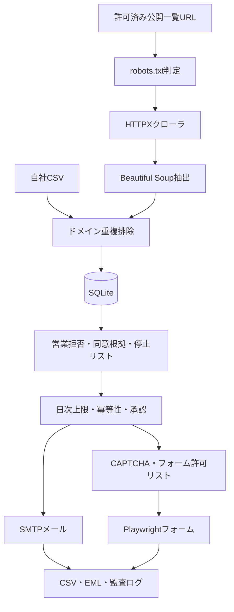

# アーキテクチャ

本システムは「送れるか」ではなく「送ってよいことを説明できるか」を中心に設計しています。収集、正規化、ポリシー判定、配送、監査を分離し、各段階で停止できます。

## コンポーネント

- `crawler.py`: robots.txt、User-Agent、遅延、最大ページ数を守る収集器。
- `extract.py`: JSON-LD、公開メール、電話、フォーム、拒否表示を抽出。
- `policy.py`: 承認、同意根拠、停止、上限、冪等性、フォーム許可リストを強制。
- `mailer.py`: SMTPとEMLドライラン。送信者と停止受付先を付与。
- `forms.py`: Playwrightによる決定論的入力。CAPTCHA回避は行わない。
- `api.py` / `cli.py`: API操作と日次バッチ。

## データモデル

- `Company`: 法人、ドメイン、公開窓口、同意根拠、拒否証跡
- `Campaign`: 件名・本文テンプレート、チャネル、上限、承認
- `OutreachAttempt`: 実行日、結果、理由、冪等性キー
- `Suppression`: メール／ドメイン停止情報

SQLiteは単一ワーカー向けです。対象数が増えたらPostgreSQL、Redis、ワーカーキュー、分散レート制限、ドメイン別ワーカーを追加します。収集部分はScrapyへ置換し、配送部分はポリシーゲートの後段に維持します。
